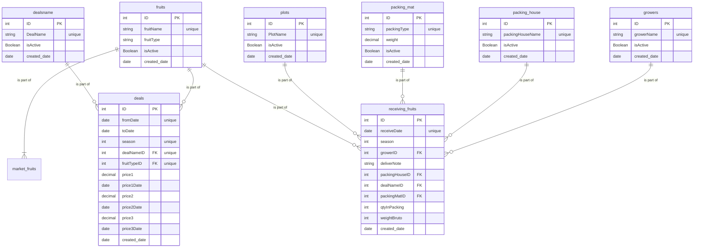

```mermaid
    erDiagram
        dealsname ||--o{ deals : "is part of"  
        fruits ||--o{ deals : "is part of"
     
        fruits ||--o{ receiving_fruits : "is part of"      
        plots ||--o{ receiving_fruits : "is part of"
        packing_mat ||--o{ receiving_fruits : "is part of"
        packing_house ||--o{ receiving_fruits : "is part of"
        growers ||--o{ receiving_fruits : "is part of"
        fruits ||--|{ market_fruits : "is part of" 

fruits{
        int ID PK
        string fruitName "unique"
        string fruitType
        Boolean isActive
        date created_date
     }

dealsname{
        int ID  PK
        string DealName "unique"
        Boolean isActive
        date created_date
     }

deals{
        int ID  PK
        date fromDate  "unique"
        date toDate
        int season "unique"
        int dealNameID FK "unique"
        int fruitTypeID FK "unique"
        decimal price1
        date price1Date
        decimal price2
        date price2Date
        decimal price3
        date price3Date
        date created_date
     }

plots{
        int ID PK
        string PlotName "unique"
        Boolean isActive
        date created_date
     }

packing_mat{
        int ID PK
        string packingType "unique"
        decimal weight
        Boolean isActive
        date created_date
     }


packing_house{
        int ID PK
        string packingHouseName "unique"
        Boolean isActive
        date created_date
     }

growers{
        int ID PK
        string growerName "unique"
        Boolean isActive
        date created_date
     }

receiving_fruits{
        int ID PK
        date receiveDate "unique"
        int season
        int growerID FK
        string deliverNote
        int packingHouseID FK
        int dealNameID FK
        int packingMatID FK
        int qtyInPacking 
        int weightBruto 
        date created_date
    }
```

