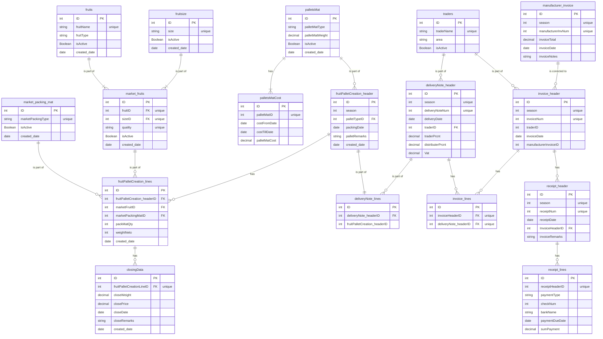

```mermaid
    erDiagram
        fruits ||--|{ market_fruits : "is part of"
        fruitsize ||--|{ market_fruits : "is part of"
        market_packing_mat ||--o{ fruitPalletCreation_lines : "is part of"
        market_fruits ||--o{ fruitPalletCreation_lines : "is part of"
        palletsMat ||--|{ palletsMatCost : has
        palletsMat ||--o{ fruitPalletCreation_header : "is part of"
        fruitPalletCreation_header ||--|| deliveryNote_lines : "is part of"
        fruitPalletCreation_header ||--o{ fruitPalletCreation_lines : has
        traders ||--o{ deliveryNote_header : "is part of"
        traders ||--o{ invoice_header : "is part of"
        manufacturer_invoice ||--o{ invoice_header : "is conncted to"
        deliveryNote_header ||--o{ deliveryNote_lines : "is part of"
        deliveryNote_header ||--o{ invoice_lines : has
        invoice_header ||--o{ receipt_header : has
        invoice_header ||--o{ invoice_lines : has
        receipt_header ||--o{ receipt_lines : has
        fruitPalletCreation_lines ||--o{ closingData : has

fruits{
    int ID  PK
    string fruitName "unique"
    string fruitType
    Boolean isActive
    date created_date
    }

fruitsize{
    int ID  PK
    string size "unique"
    Boolean isActive
    date created_date
     }


market_fruits{
    int ID  PK
    int fruitID FK "unique"
    int sizeID FK "unique"
    string quality  "unique"
    Boolean isActive
    date created_date
     }

market_packing_mat{
    int ID  PK
    string marketPackingType  "unique"
    Boolean isActive
    date created_date
}

fruitPalletCreation_lines{
    int ID  PK
    int fruitPalletCreation_headerID FK 
    int marketFruitID FK 
    int marketPackingMatID FK
    int packMatQty
    int weightNeto
    date created_date
}

closingData{
    int ID  PK
    int fruitPalletCreationLineID FK "unique"
    decimal closeWeight 
    decimal closePrice
    date closeDate
    string closeRemarks
    date created_date
}

palletsMat{
    int ID  PK
    string palletMatType
    decimal palletMatWeight
    Boolean isActive
    date created_date
}

fruitPalletCreation_header{
    int ID  PK
    int season
    int palletTypeID FK
    date packingDate
    string palletRemarks
    date created_date
}

deliveryNote_lines{
    int ID  PK
    int deliveryNote_headerID FK
    int fruitPalletCreation_headerID
}

traders{
    int ID  PK
    string traderName "unique"
    string area
     Boolean isActive
}

deliveryNote_header{
    int ID  PK
    int season   "unique"
    int deliveryNoteNum "unique"
    date deliveryDate
    int traderID FK
    decimal traderPrcnt
    decimal distributerPrcnt
    decimal Vat
}

palletsMatCost{
    int ID  PK
    int palletMatID "unique"
    date costFromDate
    date costTillDate
    decimal palletMatCost
}


invoice_lines{
    int ID PK   
    int invoiceHeaderID FK "unique"
    int deliveryNote_headerID FK "unique"
}


manufacturer_invoice{
    int ID PK
    int season "unique"
    int manufacturerInvNum "unique"
    decimal invoiceTotal
    date invoiceDate
    string invoiceNotes
}


invoice_header{
    int ID PK
    int season "unique"
    int invoiceNum "unique"
    int traderID
    date invoiceDate
    int manufacturerInvoiceID
}

receipt_lines{
    int ID PK
    int receiptHeaderID "unique"
    string  paymentType 
    int checkNum
    string bankName
    date paymentDueDate
    decimal sumPayment
}

receipt_header{
    int ID PK
    int season "unique"
    int receiptNum "unique"
    date receiptDate
    int InvoiceHeaderID FK
    string invoiceRemarks


}
```

